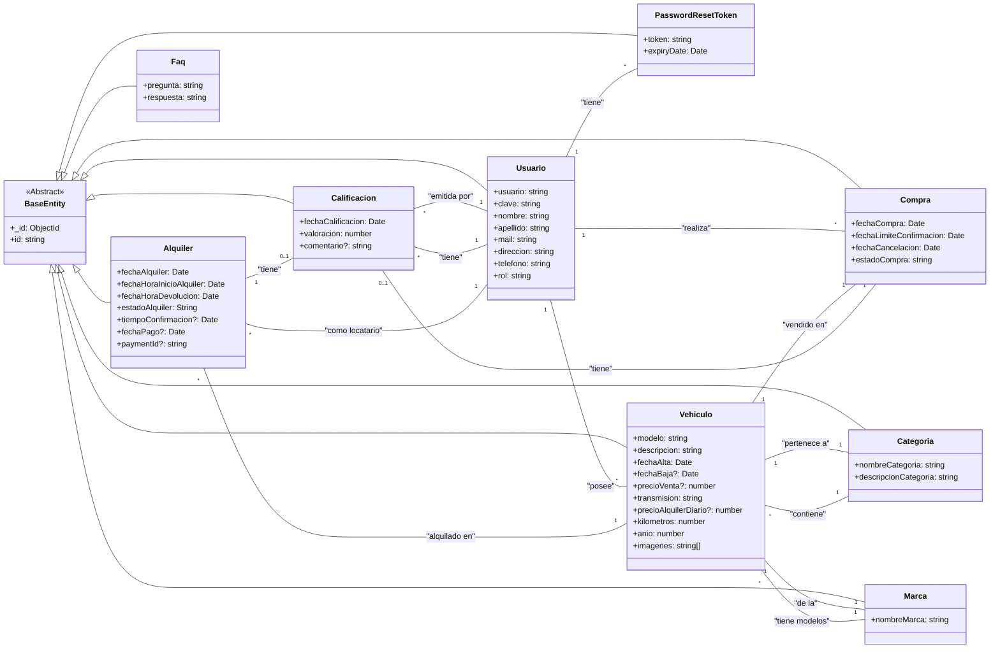

> [!NOTE]
> Diagrama realizado con mermaID

```mermaid

classDiagram
  direction LR
  
  class BaseEntity {
    <<Abstract>>
    +_id: ObjectId
    +id: string
  }

  class Alquiler {
    +fechaAlquiler: Date
    +fechaHoraInicioAlquiler: Date
    +fechaHoraDevolucion: Date
    +estadoAlquiler: String
    +tiempoConfirmacion?: Date
    +fechaPago?: Date
    +paymentId?: string
  }

  class Compra {
    +fechaCompra: Date
    +fechaLimiteConfirmacion: Date
    +fechaCancelacion: Date
    +estadoCompra: string
  }

  class Faq {
    +pregunta: string
    +respuesta: string
  }

  class Calificacion {
    +fechaCalificacion: Date
    +valoracion: number
    +comentario?: string
  }

  class PasswordResetToken {
    +token: string
    +expiryDate: Date
  }

  class Usuario {
    +usuario: string
    +clave: string
    +nombre: string
    +apellido: string
    +mail: string
    +direccion: string
    +telefono: string
    +rol: string
  }

  class Categoria {
    +nombreCategoria: string
    +descripcionCategoria: string
  }

  class Marca {
    +nombreMarca: string
  }

  class Vehiculo {
    +modelo: string
    +descripcion: string
    +fechaAlta: Date
    +fechaBaja?: Date
    +precioVenta?: number
    +transmision: string
    +precioAlquilerDiario?: number
    +kilometros: number
    +anio: number
    +imagenes: string[]
  }

  BaseEntity <|-- Alquiler
  BaseEntity <|-- Compra
  BaseEntity <|-- Faq
  BaseEntity <|-- Calificacion
  BaseEntity <|-- PasswordResetToken
  BaseEntity <|-- Usuario
  BaseEntity <|-- Categoria
  BaseEntity <|-- Marca
  BaseEntity <|-- Vehiculo

  Alquiler "1" -- "0..1" Calificacion : "tiene"
  Compra "1" -- "0..1" Calificacion : "tiene"
  Usuario "1" -- "*" Calificacion : "tiene"
  Usuario "1" -- "*" Compra : "realiza"
  Usuario "1" -- "*" Vehiculo : "posee"
  Usuario "1" -- "*" Alquiler : "como locatario"
  Usuario "1" -- "*" PasswordResetToken : "tiene"
  Vehiculo "1" -- "1" Compra : "vendido en"
  Vehiculo "1" -- "*" Alquiler : "alquilado en"
  Vehiculo "1" -- "1" Categoria : "pertenece a"
  Vehiculo "1" -- "1" Marca : "de la"
  Categoria "1" -- "*" Vehiculo : "contiene"
  Marca "1" -- "*" Vehiculo : "tiene modelos"
  Calificacion "*" -- "1" Usuario : "emitida por"
```
